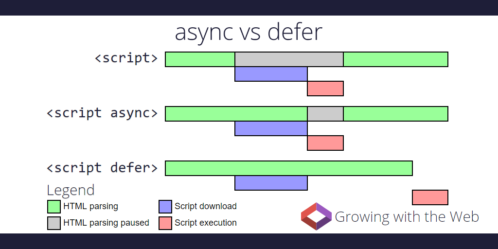

# How Defer Influences Rendering Process

`index.html`

```html
<!DOCTYPE html>
<html>
  <head>
    <link
      rel="stylesheet"
      href="https://stackpath.bootstrapcdn.com/bootstrap/3.4.1/css/bootstrap.min.css"
      integrity="sha384-HSMxcRTRxnN+Bdg0JdbxYKrThecOKuH5zCYotlSAcp1+c8xmyTe9GYg1l9a69psu"
      crossorigin="anonymous"
    />
  </head>

  <body>
    <!-- <script>
      document.addEventListener("DOMContentLoaded", function () {
        console.log("DOMContentLoaded has fired");
      });
    </script> -->
    <script src="./main.js" defer></script>
    <script src="./main2.js" async></script>
    <div id="app">hello</div>
  </body>

  <style media="screen">
    #app {
      width: 100px;
      height: 100px;
      border: red 1px solid;
    }
  </style>
</html>
```

`main.js`

```js
console.log(1);
```

`main2.js`

```js
console.log(2);
```

add network throttle setting


without defer


with defer


html parsing relation with js



normally, dom and css parse parallel，but when mixin js：

- without defer/async case, script excutes waiting css parse
- within defer/async case, js excuting don't wait css parsing (this article is written in 2018, in latest chrome, defer js excuting will wait css parsing)
- async script won't be excuted until html parsing through the line of async script, even if this aysnc script is downloaded. so inserting a async script contianed log could test whether html has parsed through this line
- the defer attribute is ignored if the `<script>` tag has no `src`
- all scripts will start downloading before dom is parsed, because a preanalysis. Specific starting time of preanalysis resources download is influenced by the [priority of resource](https://docs.google.com/document/d/1bCDuq9H1ih9iNjgzyAL0gpwNFiEP4TZS-YLRp_RuMlc/edit?pli=1)
- use preload or fetchpriority is anothor topic

event flow: readyState:interactive-> deferjs -> DOMContentLoaded -> load img/iframe... -> dreadyState:complete -> onLoad

by the way,
dynamically inserted script is async by default, if we need certain order, set `script.async = false`.
module script is defer by default
