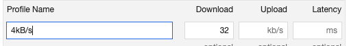

# defer 对浏览器渲染流程影响探究

`index.html`

```html
<!DOCTYPE html>
<html>
  <head>
    <link
      rel="stylesheet"
      href="https://stackpath.bootstrapcdn.com/bootstrap/3.4.1/css/bootstrap.min.css"
      integrity="sha384-HSMxcRTRxnN+Bdg0JdbxYKrThecOKuH5zCYotlSAcp1+c8xmyTe9GYg1l9a69psu"
      crossorigin="anonymous"
    />
  </head>

  <body>
    <script src="./main.js" defer></script>
    <div id="app">hello</div>
  </body>

  <style media="screen">
    #app {
      width: 100px;
      height: 100px;
      border: red 1px solid;
    }
  </style>
</html>
```

`main.js`

```js
console.log(1);
```

add network throttle setting



without defer


with defer


normally, dom and css parse parallel，but when mixin js：

- without defer case，dom parse wait script, script wait css parse
- with defer case, dom parse don't wait js excute, and js excute don't wait css parse
- all script will start download defore dom parsed, because a preanalysis

event flow: domInteractive -> deferjs -> DOMContentLoaded -> load img -> domComplete -> onLoad

by the way,
async script don't wait anything else, nothing wait async script, except it excute may block dom parse.
dynamic insert script default is async, if we need certain order, set `script.async = false`
module script default is defer
