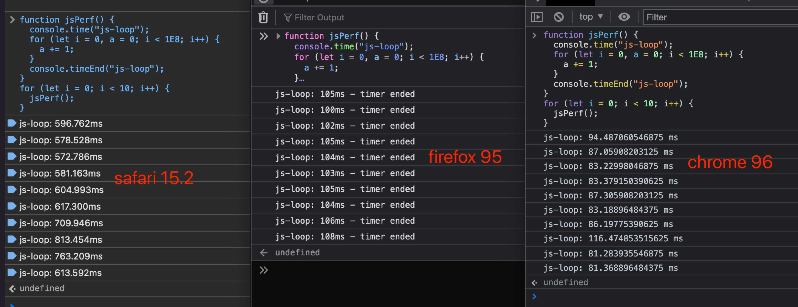
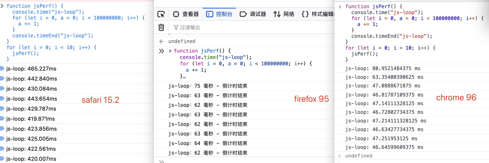

# Browsers JS Benchmarks

macos 11.3.1
macbook pro 13-inch 2017
processor 2.5 GHz Dual-Core Intel Core i7

```js
function jsPerf() {
  console.time("js-loop");
  for (let i = 0, a = 0; i < 1e8; i++) {
    a += 1;
  }
  console.timeEnd("js-loop");
}
for (let i = 0; i < 10; i++) {
  jsPerf();
}
```


Chrome96 : Firefox95 : Safari15.2 speed is 7 : 6 : 1 or so

---

macos 12.1
macbook pro 14-inch 2021
processor 3.2GHz 8+2-Core M1 Pro



Chrome96 : Firefox95 : Safari15.2 speed is 8.5 : 6.5 : 1 or so
