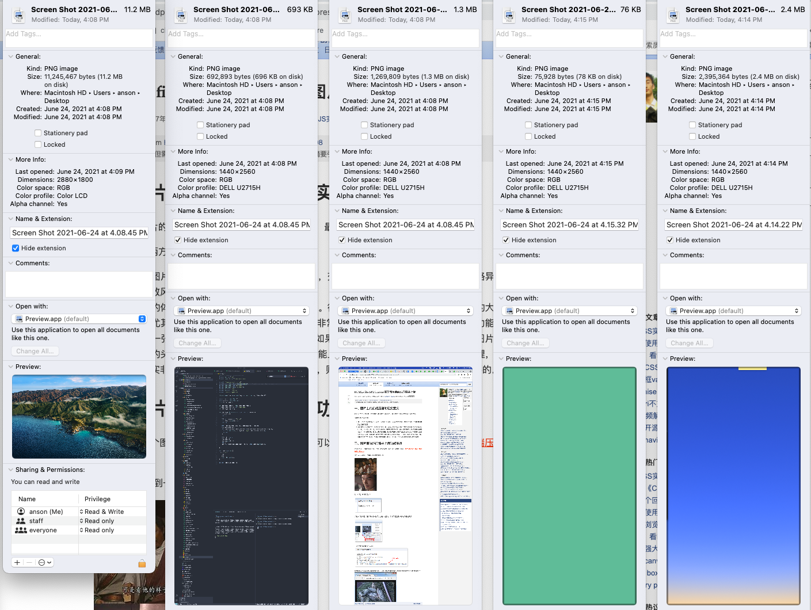

# 图片大小

- 图片像素数量和字节数量没有直接关系，储存时候会压缩



- 图片通过 canvas getImageData 后转化为 Uint8ClampedArray 类型数组（每位 8bit），无 meta 信息，可以按像素操作，此时 array buffer 数组大小就是 4（RGBA）\* 像素数量（width x height）
- content-length 是传输数据(请求体 body 部分,实际传输)的字节(Byte)数

---

test code:

```html
<html>
  <body>
    
    <canvas></canvas>
    <input type="file" onchange="change(this)" />
  </body>

  <script>
    const img = document.querySelector("img");
    const canvas = document.querySelector("canvas");

    function change(e) {
      console.log(e.files[0].size);
      img.src = URL.createObjectURL(e.files[0]);
    }

    function draw() {
      const ctx = canvas.getContext("2d");
      canvas.width = 300;
      canvas.height = 500;
      ctx.drawImage(img, 0, 0, 300, 500);
      console.log(ctx.getImageData(0, 0, 300, 500));
    }

    function compress() {
      canvas.toBlob(
        function (blob) {
          const link = document.createElement("a");
          link.href = URL.createObjectURL(blob);
          link.download = "canvas";
          link.click();
        },
        "image/jpeg",
        0.5
      );
    }
  </script>
</html>
```
