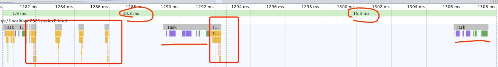
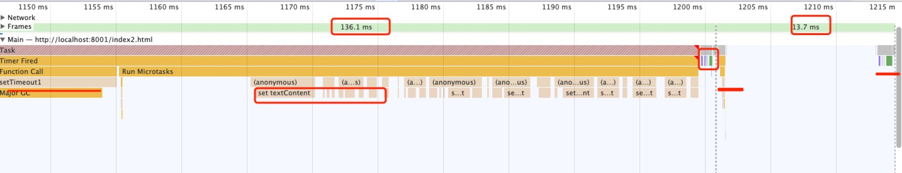

# 浏览器渲染时机

以下使用 chrome 90 测试，

```js
<button id="test">text</button>
<script>
  const button = document.getElementById("test");
  button.onclick = function() {
    setTimeout(function() {
      button.textContent = 0;
      setTimeout(function() {
        button.textContent = 1;
        setTimeout(function() {
          button.textContent = 2;
          setTimeout(function() {
            button.textContent = 3;
            setTimeout(function() {
              button.textContent = 4;
            }, 0);
          }, 0);
        }, 0);
      }, 0);
    }, 0);
  };
</script>
```

黄块为 setTimeout job，下图可见并没有每次修改 dom 都触发渲染（紫色、绿色），浏览器根据渲染帧数（这里 10-16ms）动态在 macroTask 间进行渲染，需要每次改动被渲染用 requestAnimationFrame



```js
<button id="test">text</button>
<script>
  const button = document.getElementById("test");

  button.onclick = function() {
    setTimeout(function setTimeout1() {
      button.textContent = "task1";
      for (var i = 0; i < 250000; i++) {
        Promise.resolve().then(function() {
          button.textContent = i;
        });
      }
    }, 0);
    setTimeout(function setTimeout2() {
      button.textContent = "task2";
    }, 0);
  };
</script>
```

这次在两个 macroTask 间插入了一个很长的 microTask，下图可见渲染被 microTask 阻塞了一百多 ms，直到 microTask 完成才进行渲染，然后再处理下一个 macroTask 和下一帧进行渲染



当前的 microTasks 以及 microTask 回调中产生的 microTask 都会在任何其他任务前顺序处理完.
当前的 requestAnimationFrame jobs 也需要在渲染前都执行完, 但是 requestAnimationFrame 回调中产生的 requestAnimationFrame 是安排到下一帧处理

---

vue 有个 $nextTick 的概念, 批量的同步代码会在一个 tick 内全部执行掉产生合并的 change (第一次汇总), 提交在 nextTick(microTask) 发生, 做 update vdom, vdom diff 和 dispatch (第二次汇总) 到真实 dom, 在 nextTick 的回调中才可以取到真实 dom 的变化. 这从浏览器角度这些过程只是经过了一个微任务, 虽然修改了 dom, 真实渲染执行还是要等浏览器到下一个渲染时机(无阻塞任务且到帧率时间)
