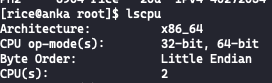
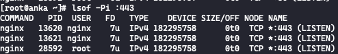

# Multi Processes & Threads

## multiple processes listening on the same port

testing machine: dual core processor cpu

nginx master process and worker process listening on the same port, using the kernel load balance [SO_REUSEPORT](<https://man7.org/linux/man-pages/man7/socket.7.html#:~:text=SO_REUSEPORT%20(since%20Linux%203.9)>) to distribute socket request（each socket need have the same process UID）

pm2 / node:cluster mode, master process handles socket request, then distribute to worker process by round-roubin, worker process has not port listening.  
pm2 underlying use [node:cluster](https://github.com/Unitech/pm2/blob/da59cb6dd761546686e5f89dbc8126672d8b3460/lib/God/ClusterMode.js), and cluster underlying use child_process.fork, while bare forking requires you to handle the connections on your own.  
fork mode only support nodejs subprocess.

## node threads using in cpu-intensive javascript operations

worker threads could using multiple cpu cores at the same time，each thread has it's own standalone V8 and EventLoop，no GIL

> V8 allows you to spawn isolated V8 runtimes. V8 Isolate is isolated instances with their Javascript heaps and micro-task queues.These segregated V8 engines operate worker threads, with each worker having its V8 engine and event queue.

## browser main js thread

can be blocked by `alert('something')`

## coroutine

Unlike processes or threads, coroutine is cooperative multitasking, not preemptive multitasking. It's implemented based on single thread, and switch context by user rather than system.
