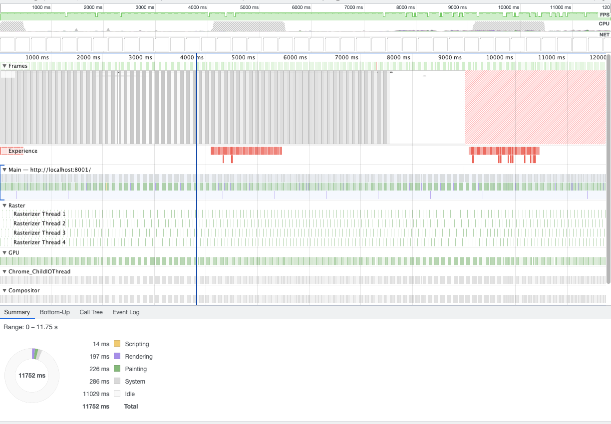
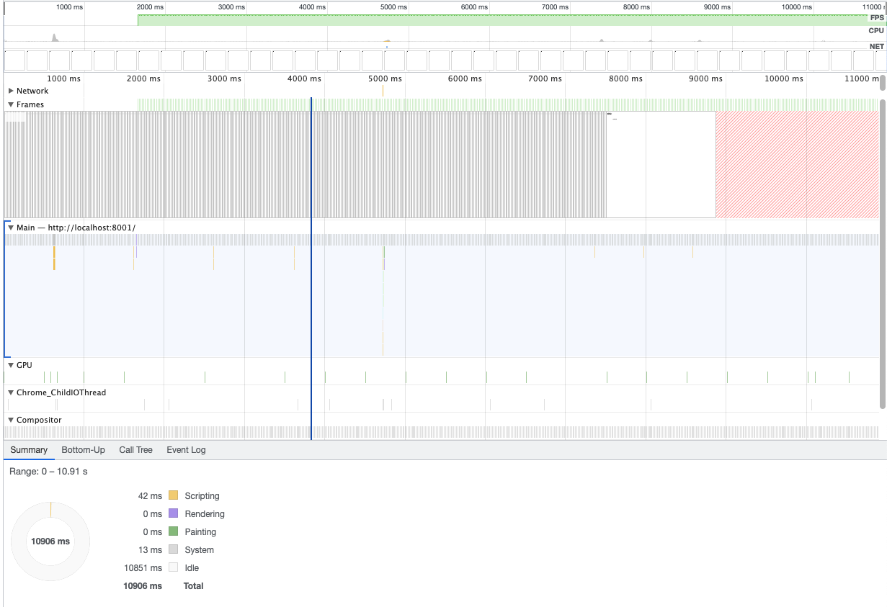
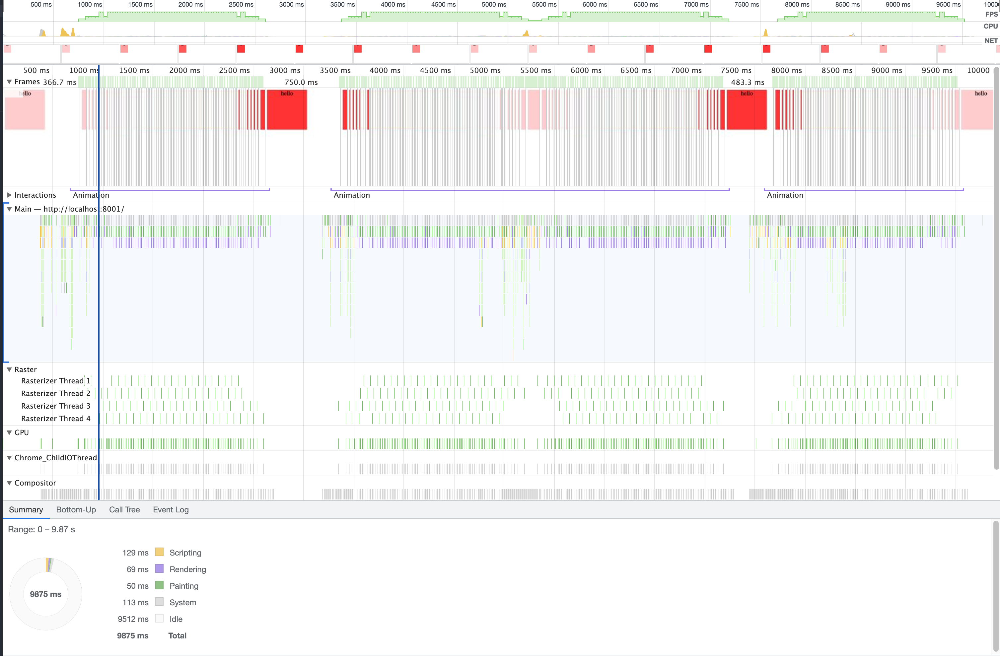
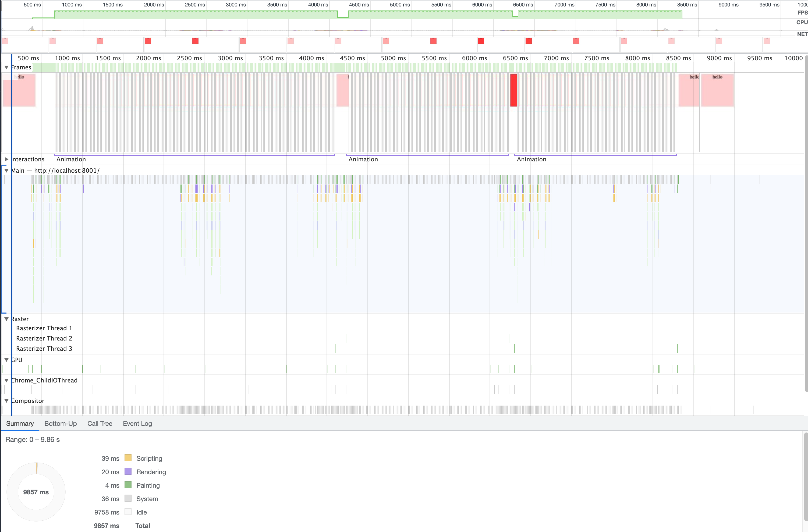

# 一个渲染性能优化实践

## 移动动画

### 未优化

```html
<html>
  <body>
    <h1>title</h1>
    <p>content</p>
  </body>
  <style>
    @keyframes move {
      from {
        left: 0;
      }
      to {
        left: 600px;
      }
    }
    p {
      position: absolute;
      animation: move 5s ease-in-out infinite alternate;
    }
  </style>
</html>
```



连续触发 layout 和 paint 事件(生成 paint 指令), raster 线程执行 paint 指令

### 初步优化

```html
<html>
  <body>
    <h1>title</h1>
    <p>content</p>
  </body>
  <style>
    @keyframes move {
      from {
        left: 0;
      }
      to {
        left: 600px;
      }
    }
    p {
      position: absolute;
      will-change: left;
      animation: move 5s ease-in-out infinite alternate;
    }
  </style>
</html>
```


将动画提升到单独的层交由 gpu 处理, 主线程不再负责该层的 layout and paint, 仍要负责整体的 recalculate style,update layer tree 和 composite layers 工作, 同时可以看到 layout shift regions 一直在变化

### 再优化

```html
<html>
  <body>
    <h1>title</h1>
    <p>content</p>
  </body>
  <style>
    @keyframes move {
      from {
        translate: translateX(0);
      }
      to {
        transform: translateX(600px);
      }
    }
    p {
      position: absolute;
      animation: move 5s ease-in-out infinite alternate;
    }
  </style>
</html>
```



**仅用 transform 及 opacity** 实现的动画, 主线程 rendering 和 painting 工作完全不需要了, graphics layers 层动画结果直接与主图层叠加

## 分析

每个图层完成自己的工作互不影响, compose 阶段再整合各自工作结果 (叠加或者外边距计算等)

紫色 rendering 包含紫色步骤: recalculate style, layout 等
绿色 painting 包含 paint, composite layers 等

查看细节信息可以自己运行代码或者使用我导出的 profile 文件: [Profile examples.zip](https://github.com/anson09/blog/files/8087383/Profile.examples.zip)

---

## 市场行情红绿动画性能消耗优化前后对比

### 优化前

```html
<html>
  <style>
    div {
      width: 200px;
      height: 200px;
      font-size: 30px;
      text-align: center;
      background-color: rgba(255, 0, 0, 0.2);
      transition: background-color 2s ease-in-out;
    }
    div:hover {
      background-color: rgba(255, 0, 0, 0.8);
    }
  </style>
  <body>
    <div>hello</div>
  </body>
</html>
```



### 优化后

```html
<html>
  <style>
    div {
      width: 200px;
      height: 200px;
      font-size: 30px;
      text-align: center;
      position: relative;
    }
    div:hover::after {
      opacity: 0.8;
    }
    div::after {
      content: "";
      width: 200px;
      height: 200px;
      background-color: red;
      position: absolute;
      left: 0;
      opacity: 0.2;
      z-index: -1;
      transition: opacity 2s ease-in-out;
    }
  </style>
  <body>
    <div>hello</div>
  </body>
</html>
```



[Profile examples.zip](https://github.com/anson09/blog/files/8106171/Profile.-.examples.zip)
